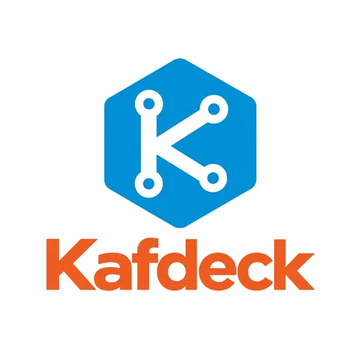

# Kafdeck

**The Open Source Kafka Control Plane**

Secure, vendor-neutral, operations-first visibility for Apache Kafka.

[Getting Started](#getting-started) ·
[Features](#feature-matrix) ·
[Configuration](#configuration) ·
[Security](#security-model) ·
[Contributing](#contributing) ·
[Support](#support)

---

Kafdeck is a self-hosted control plane for Apache Kafka designed for operators who need useful Kafka visibility **without turning the management UI into another reliability or security risk**.

It runs outside the Kafka data path, supports local/on-premise and air-gapped deployments, uses bounded read operations, and keeps metadata access, record access, export, identity, and masking as separate security concerns.

> [!IMPORTANT]
> **v0.7 is the current release line.** Read-only remains the default operating posture. v0.7 adds governed Schema Registry lifecycle and developer tooling, multi-profile Kafka Connect with bounded auto-restart, controlled SerDe and finite data jobs/generation, bounded ksqlDB and Streams/lineage evidence, plus a keyboard-first Command Palette. Governed mutations remain opt-in, and unsupported or unsafe provider capabilities remain explicit `Blocked`/`Unsupported` states rather than falling through to a generic provider/CLI escape path.

## Why Kafdeck?

- **Safe by default** — bounded work, cancellation, deadlines, rate/byte limits, per-cluster isolation, and fail-closed behavior.
- **Read access is not data access** — metadata permissions never automatically grant Kafka payload visibility.
- **Server-side masking** — sensitive record data is redacted before it reaches the browser, API client, or export path.
- **No mandatory data-plane proxy** — Kafdeck stays out of the Kafka message path.
- **Zero-write observation** — read-only Kafdeck does not create internal Kafka topics or need Kafka write access to store its own state.
- **Vendor-neutral core** — Apache Kafka semantics define the baseline; ecosystem/provider integrations are capability-gated.
- **On-premise and air-gapped friendly** — core runtime functionality has no required SaaS dependency.
- **Governed OSS engineering** — architecture, security, compatibility, release evidence, and project decisions are versioned in the repository.

## Project status

Stable releases are published through [GitHub Releases](https://github.com/araditc/Kafdeck/releases). **v0.7 is the active/current release identity selected by the governed release manifest.** The protected-main publication workflow owns the immutable source tag, GitHub Release and GHCR promotion for that identity. The main branch can also contain capabilities that have passed implementation gates but are not part of a later published release.

| Current capability | Introduced | Current v0.7 posture |
| --- | --- | --- |
| Cluster & broker explorer | v0.1 | Available; bounded, cancellable, evidence-based |
| Operator Identity / OIDC / RBAC | v0.2 | Available; OIDC is the recommended multi-user production mode |
| Safe Data Explorer + server-side masking | v0.3 | Available; payload access/export remain separately authorized |
| Consumers / Schemas / Ecosystem observations | v0.4 | Available and extended by later releases |
| Governed Kafka administration | v0.5 | Available when mutation mode and durable prerequisites are explicitly enabled |
| Fleet capability boundary / secure remote UI | v0.6 | Capability-driven; unsupported or unsafe operations remain explicit Blocked/Unsupported |
| Developer & Streaming Ecosystem Platform | v0.7 | Active release; governed Schema/Connect/data tooling, bounded streaming integrations, Command Palette and evidence-driven status truth |

See [ROADMAP.md](ROADMAP.md) for the capability roadmap and [docs/releases/](docs/releases/) for exact release evidence.

## Feature matrix

The release table above records when capability families first appeared. The sections below describe the **current v0.7 behavior**.

### Cluster and broker operations

- multiple immutable configuration-driven Kafka clusters,
- broker/controller metadata,
- topics, partitions, leaders, replicas and ISR,
- topic and broker configuration inspection where authorized/supported,
- evidence-based cluster/partition health,
- bounded snapshots, deadlines, cancellation, stale/partial semantics and per-cluster isolation.

### Identity, authorization and audit

- Local, deployment-token and OIDC access modes,
- OIDC Authorization Code + PKCE with server-side sessions,
- immutable default-deny RBAC in OIDC mode,
- subject/group bindings,
- action-, cluster- and resource-scoped authorization,
- backend-authoritative enforcement for UI and API clients,
- structured security audit events,
- deployment access tokens held in page memory only after URL-fragment bootstrap.

### Safe Data Explorer and masking

- bounded record browsing by topic/partition,
- earliest/latest/offset/timestamp navigation and previous-page reads,
- bounded live tail,
- key/value/header inspection,
- raw, UTF-8, binary/hex and structured projections,
- Schema Registry-assisted Avro / Protobuf / JSON Schema decoding,
- controlled CBOR / XML / MessagePack SerDe,
- bounded filtering,
- explicit record/byte/time/rate/concurrency budgets,
- server-side masking before UI/API/export,
- separate `record.read` and `record.export` authorization,
- bounded JSON / NDJSON / CSV export,
- no payload persistence by default.

### Consumers and diagnostics

- consumer groups, states, members and assignments,
- committed/end offsets and per-partition/aggregate lag,
- explicit missing / unauthorized / out-of-range states,
- evidence-based inactive/stalled diagnostics,
- metrics/history only when a trustworthy provider exists — unknown data is never fabricated as zero.

### Schema Registry lifecycle and developer tooling

- subjects, versions, schema IDs, formats, content and references,
- Avro, Protobuf and JSON Schema,
- bounded reference graph,
- deterministic schema diff,
- compatibility inspection and explanation,
- bounded deterministic mock examples,
- governed registration, compatibility changes and delete lifecycle where the configured provider supports them,
- explicit provider capability truth: Confluent-compatible baseline, tested Karapace-compatible profile, and Apicurio reported Unsupported until its distinct typed adapter is admitted,
- lifecycle writes require mutation mode and the exact authorization/risk/approval path; read access never implies schema mutation.

### Kafka Connect administration

- multiple stable Connect profiles per Kafka cluster,
- worker, connector, task and bounded trace observations,
- plugin discovery and typed configuration validation,
- fail-closed secret/configuration projection,
- governed create/update/delete/pause/resume/restart/task-restart where provider capability and mutation policy allow it,
- legacy single `Connect` configuration remains backward compatible as profile `default`; new deployments should use `ConnectProfiles[]`,
- optional bounded auto-restart with durable attempts/backoff/lifetime/circuit state, disabled by default,
- shared MirrorMaker/replication guards prevent a generic Connect lifecycle route from bypassing Kafdeck policy.

### Governed Kafka administration

State-changing operations are opt-in and use the same server-owned pipeline:

`Request -> Authorization -> Validation -> Risk Classification -> Preview -> Confirmation/Approval -> Execute -> Verify -> Audit`

Current governed families include:

- topic create/alter/delete and partition increases,
- bounded record production,
- consumer offset/group administration,
- Schema Registry lifecycle mutations,
- Kafka Connect lifecycle mutations,
- controlled DeleteRecords purge,
- finite replay/reprocess/DLQ/forwarding jobs,
- bounded Data Generator execution.

Safety properties include server-owned LOW / MODERATE / HIGH / CRITICAL risk floors, distinct-principal approval for CRITICAL operations, durable idempotency and operation state, SQLite standalone persistence, PostgreSQL multi-instance/HA persistence, cluster-wide execution slots, restart-safe leases and explicit no-blind-retry semantics for ambiguous external effects.

### Data jobs and Smart Mock / Data Generator

- finite replay, reprocess, DLQ forwarding and cross-topic/cross-cluster forwarding,
- exact frozen source/destination identity and finite count/byte/rate/duration budgets,
- durable checkpoints/fencing without durable raw-payload staging,
- deterministic generator seed,
- schema-backed or closed built-in generation sources,
- explicit destination enable policy,
- hard server-side volume/rate/time ceilings,
- one unresolved external-write batch maximum,
- ambiguous writes require explicit reconciliation and are never blindly replayed.

### Streaming ecosystem and lineage

- bounded single-statement read-only ksqlDB `SELECT` execution,
- row/byte/time/concurrency limits and cancellation,
- DDL, DML, persistent-query creation and generic SQL forwarding blocked before provider I/O,
- registered Kafka Streams application/topology evidence,
- state-store/RocksDB metrics only when registered telemetry exposes them,
- lineage edges carry provenance, confidence, observed time and `Observed` / `Inferred` evidence kind,
- inferred lineage never satisfies authorization.

### Fleet capability truth

Kafdeck exposes fleet capability state explicitly instead of simulating missing provider primitives. A capability may be `Supported`, `Blocked`, `Unsupported`, `Unconfigured`, `Unavailable` or `Unknown`. Kafdeck does not substitute CLI, reflection, raw protocol, sidecars or arbitrary provider HTTP calls to hide a capability gap.

### Topic catalog and operator UX

- topic description, owner/team, domain, tags, documentation reference and classification,
- catalog metadata is descriptive and never grants Kafka permissions,
- keyboard-first Command Palette with Ctrl/Cmd+K,
- unified explicit status semantics for denied/unsupported/blocked/partial/stale/unavailable/unknown/approval states,
- locally bundled Tabler/frontend assets with no runtime CDN dependency,
- reduced-motion and keyboard/focus-management support.

## How Kafdeck works

~~~mermaid
flowchart LR
    B[Browser / API client] --> A[Kafdeck HTTP API]
    A --> I[Access boundary Local / Token / OIDC]
    I --> R[Authorization + Risk + Audit]
    R --> S[Application services]

    S --> K[Kafka typed adapters]
    S --> SR[Schema Registry typed adapter]
    S --> C[Kafka Connect typed adapter]
    S --> Q[Bounded ksqlDB adapter]
    S --> T[Registered Streams telemetry]
    S --> J[Durable mutation / job coordinator]

    K --> KF[(Apache Kafka)]
    SR --> REG[(Schema Registry)]
    C --> CON[(Kafka Connect)]
    Q --> KSQL[(ksqlDB)]
    T --> APP[(Registered app telemetry)]

    J --> K
    J --> SR
    J --> C

    S --> M[Server-side masking / bounded projection]
    M --> A
~~~

The important part is what is **not** in this diagram: Kafdeck is not a generic Kafka producer proxy, broker plugin, arbitrary provider HTTP/SQL console, consumer-group member for normal browsing, or mandatory data-plane gateway.

When administration is disabled, state-changing routes fail closed and Kafdeck remains observational. When administration is enabled, every admitted effect still passes through typed authorization, server-owned risk classification, preview/confirmation/approval, durable idempotency/fencing, verification and audit. Long-running data jobs and generator work remain finite and budgeted; ambiguous provider effects are not blindly retried.

A typical request flows like this:

1. configuration is loaded and validated at startup;
2. the deployment access boundary authenticates the caller;
3. OIDC deployments apply Kafdeck RBAC before upstream I/O;
4. the application invokes an admitted typed read, mutation, job or ecosystem port;
5. server-owned bounds, deadlines, capabilities and authorization are enforced before provider I/O;
6. record payloads are decoded and masked server-side where required;
7. only a safe projection or governed operation state is returned to the client;
8. security-sensitive activity is audited without persisting secrets, raw generated payloads or query-result rows.

## Getting started

### Recommended path: OCI / Docker

Kafdeck releases are published as a single non-root OCI image. The current release is:

~~~text
ghcr.io/araditc/kafdeck:v0.7
~~~

For production, pin the immutable v0.7 digest:

~~~text
ghcr.io/araditc/kafdeck@sha256:2e089bfe4788d93e7f9b5d03fac117001daccd06c244f1017648d5ccf57535c8
~~~

Do not rely on <code>latest</code>.

### 1. Start a container-reachable Kafka for evaluation

For the Docker quick start, put Kafka and Kafdeck on the same user-defined network and advertise a Kafka listener that is reachable **from the Kafdeck container**:

~~~bash
docker network create kafdeck-demo

docker run -d   --name kafdeck-kafka   --network kafdeck-demo   -p 9092:9092   -e KAFKA_NODE_ID=1   -e KAFKA_PROCESS_ROLES=broker,controller   -e KAFKA_CONTROLLER_QUORUM_VOTERS=1@kafdeck-kafka:29093   -e KAFKA_CONTROLLER_LISTENER_NAMES=CONTROLLER   -e KAFKA_LISTENER_SECURITY_PROTOCOL_MAP=CONTROLLER:PLAINTEXT,INTERNAL:PLAINTEXT,HOST:PLAINTEXT   -e KAFKA_LISTENERS=CONTROLLER://:29093,INTERNAL://:19092,HOST://:9092   -e KAFKA_ADVERTISED_LISTENERS=INTERNAL://kafdeck-kafka:19092,HOST://localhost:9092   -e KAFKA_INTER_BROKER_LISTENER_NAME=INTERNAL   -e KAFKA_OFFSETS_TOPIC_REPLICATION_FACTOR=1   -e KAFKA_GROUP_INITIAL_REBALANCE_DELAY_MS=0   -e KAFKA_TRANSACTION_STATE_LOG_MIN_ISR=1   -e KAFKA_TRANSACTION_STATE_LOG_REPLICATION_FACTOR=1   -e CLUSTER_ID=4L6g3nShT-eMCtK--X86sw   apache/kafka:4.3.1
~~~

The host can use <code>localhost:9092</code>; containers on <code>kafdeck-demo</code> use <code>kafdeck-kafka:19092</code>. This distinction matters because Kafka clients follow broker-advertised listeners after bootstrap.

The repository's simpler <code>deploy/dev/docker-compose.kafka.yml</code> advertises <code>localhost:9092</code> and is intended for **host-native source development**, not for a second Docker container connecting to it.

This evaluation broker is intentionally PLAINTEXT and single-node. Do not copy its security posture into production.

### 2. Create a minimal Kafdeck configuration

Create <code>appsettings.Production.json</code>:

~~~json
{
  "Kafdeck": {
    "Deployment": {
      "ListenUrls": [
        "http://0.0.0.0:8080"
      ],
      "AccessMode": "Token",
      "AccessToken": "env:KAFDECK_DEPLOYMENT_TOKEN"
    },
    "Clusters": [
      {
        "Id": "local",
        "BootstrapServers": [
          "kafdeck-kafka:19092"
        ],
        "SecurityProtocol": "Plaintext"
      }
    ]
  }
}
~~~

`ListenUrls` is the preferred form and accepts multiple Kestrel endpoints. The legacy single `ListenUrl` key remains supported for existing deployments. When a wildcard bind such as `0.0.0.0` or `[::]` is used, Kafdeck derives a wildcard Host filter only after the deployment has passed the existing non-local Token/OIDC security checks. Concrete IP/hostname bindings derive exact allowed hosts automatically.

### 3. Run the released image

The examples below use the current released tag <code>v0.7</code>. For production, prefer the immutable digest shown above.

#### Windows / Docker Desktop

~~~powershell
$env:KAFDECK_DEPLOYMENT_TOKEN = "change-this-local-token"
docker run --rm --name kafdeck --network kafdeck-demo -p 8080:8080 -e KAFDECK_DEPLOYMENT_TOKEN=$env:KAFDECK_DEPLOYMENT_TOKEN -v "$PWD\appsettings.Production.json:/app/appsettings.Production.json:ro" ghcr.io/araditc/kafdeck:v0.7
~~~

#### Linux / Docker Engine

~~~bash
export KAFDECK_DEPLOYMENT_TOKEN='change-this-local-token'

docker run --rm \
  --name kafdeck \
  --network kafdeck-demo \
  -p 8080:8080 \
  -e KAFDECK_DEPLOYMENT_TOKEN \
  -v "$PWD/appsettings.Production.json:/app/appsettings.Production.json:ro" \
  ghcr.io/araditc/kafdeck:v0.7
~~~

Then open Kafdeck from another machine by using the server's reachable address, for example:

~~~text
http://192.168.10.20:8080/#access_token=change-this-local-token
~~~

For local access on the server itself, `http://127.0.0.1:8080/` remains valid when loopback is also included in `ListenUrls`.

The token is supplied through the URL **fragment**, not a query string. The UI immediately removes it from the address bar/history, keeps it only in page memory, and sends it as <code>X-Kafdeck-Access-Token</code> for API calls. It is not written to <code>localStorage</code> or <code>sessionStorage</code>; after a full page reload, bootstrap Token mode again with the fragment or use OIDC for persistent multi-user sessions.

> [!WARNING]
> Token mode is a deployment access boundary, not a multi-user identity system. For multi-user production deployments, use OIDC/RBAC.

### Linux with Podman

~~~bash
podman run --rm \
  --name kafdeck \
  -p 8080:8080 \
  -e KAFDECK_DEPLOYMENT_TOKEN \
  -v "$PWD/appsettings.Production.json:/app/appsettings.Production.json:ro,Z" \
  ghcr.io/araditc/kafdeck:v0.7
~~~

For Podman, create a Podman network and ensure Kafka advertises a broker hostname reachable on that network. The Docker-specific <code>kafdeck-demo</code> recipe above is not automatically shared with Podman.

## Building from source

Building from source is the best path for contributors and for testing unreleased main capabilities.

### Prerequisites

- Git,
- .NET SDK 10,
- Node.js 24+ and npm,
- Docker + Compose for the integration Kafka environment.

### Linux / macOS

~~~bash
git clone https://github.com/araditc/Kafdeck.git
cd Kafdeck

dotnet restore Kafdeck.slnx --locked-mode
dotnet build Kafdeck.slnx -c Release --no-restore

npm --prefix src/frontend ci
npm --prefix src/frontend run build

rm -rf src/backend/Kafdeck.Api/wwwroot
mkdir -p src/backend/Kafdeck.Api/wwwroot
cp -R src/frontend/dist/. src/backend/Kafdeck.Api/wwwroot/

dotnet run --project src/backend/Kafdeck.Api/Kafdeck.Api.csproj
~~~

The default application configuration remains intentionally loopback-only at <code>http://127.0.0.1:8080</code> and contains no cluster profiles. To expose a source run to another machine, explicitly select Token or OIDC mode and configure one or more <code>ListenUrls</code>. For a useful source run, either add <code>src/backend/Kafdeck.Api/appsettings.Development.json</code> or set environment variables before starting the API:

~~~bash
export Kafdeck__Deployment__ListenUrls__0=http://0.0.0.0:8080
export Kafdeck__Deployment__AccessMode=Token
export Kafdeck__Deployment__AccessToken=env:KAFDECK_DEPLOYMENT_TOKEN
export KAFDECK_DEPLOYMENT_TOKEN='change-this-local-token'
export Kafdeck__Clusters__0__Id=local
export Kafdeck__Clusters__0__BootstrapServers__0=localhost:9092
export Kafdeck__Clusters__0__SecurityProtocol=Plaintext
dotnet run --project src/backend/Kafdeck.Api/Kafdeck.Api.csproj
~~~

### Windows / PowerShell

~~~powershell
git clone https://github.com/araditc/Kafdeck.git
Set-Location Kafdeck

dotnet restore Kafdeck.slnx --locked-mode
dotnet build Kafdeck.slnx -c Release --no-restore

npm --prefix src/frontend ci
npm --prefix src/frontend run build

Remove-Item -Recurse -Force src/backend/Kafdeck.Api/wwwroot -ErrorAction SilentlyContinue
New-Item -ItemType Directory -Force src/backend/Kafdeck.Api/wwwroot | Out-Null
Copy-Item -Recurse src/frontend/dist/* src/backend/Kafdeck.Api/wwwroot/

dotnet run --project src/backend/Kafdeck.Api/Kafdeck.Api.csproj
~~~

For a local Kafka:

~~~powershell
docker compose -f deploy/dev/docker-compose.kafka.yml up -d
~~~

To point a native Windows source run at that broker:

~~~powershell
$env:Kafdeck__Deployment__ListenUrls__0 = "http://0.0.0.0:8080"
$env:Kafdeck__Deployment__AccessMode = "Token"
$env:Kafdeck__Deployment__AccessToken = "env:KAFDECK_DEPLOYMENT_TOKEN"
$env:KAFDECK_DEPLOYMENT_TOKEN = "change-this-local-token"
$env:Kafdeck__Clusters__0__Id = "local"
$env:Kafdeck__Clusters__0__BootstrapServers__0 = "localhost:9092"
$env:Kafdeck__Clusters__0__SecurityProtocol = "Plaintext"
dotnet run --project src/backend/Kafdeck.Api/Kafdeck.Api.csproj
~~~

### Build the OCI image locally

~~~bash
docker build -t kafdeck:dev .
~~~

The runtime image serves both API and UI, runs as the image-defined non-root user, exposes port 8080, and uses ASP.NET Core 10.

## Configuration

Kafdeck uses the standard ASP.NET Core configuration model. JSON configuration and environment variables can be combined. Nested environment keys use double underscores.

~~~bash
Kafdeck__Clusters__0__Id=prod
Kafdeck__Clusters__0__BootstrapServers__0=kafka-1.example:9093
Kafdeck__Clusters__0__SecurityProtocol=SaslSsl
~~~

### Access modes

| Mode | Intended use | Important behavior |
| --- | --- | --- |
| Local | Single-user local development | Must bind to loopback; no deployment token or OIDC |
| Token | Controlled management boundary / simple deployment | Requires a secret-referenced access token |
| Oidc | Multi-user production operation | Operator identity + Kafdeck RBAC; non-loopback listen URL must use HTTPS |

Local and Token modes are deployment-boundary modes and do not provide identity-scoped Kafdeck RBAC. Kafka-side ACLs and Kafdeck record masking still apply.

### Secret references

Secret fields accept:

~~~text
env:VARIABLE_NAME
file:/absolute/mounted/path
~~~

Examples:

~~~json
{
  "AccessToken": "env:KAFDECK_DEPLOYMENT_TOKEN",
  "ClientSecret": "file:/run/secrets/oidc-client-secret"
}
~~~

Do not commit actual passwords, access tokens, PEM private keys, or client secrets.

### Kafka security

Supported Kafka transport/authentication modes:

- Plaintext,
- Ssl,
- SaslPlaintext,
- SaslSsl.

Supported SASL mechanisms:

- Plain,
- ScramSha256,
- ScramSha512.

Production-oriented example:

~~~json
{
  "Id": "prod",
  "BootstrapServers": [
    "kafka-1.example:9093",
    "kafka-2.example:9093",
    "kafka-3.example:9093"
  ],
  "SecurityProtocol": "SaslSsl",
  "Tls": {
    "VerifyServerCertificate": true,
    "CaCertificate": "file:/run/secrets/kafka-ca.pem"
  },
  "Sasl": {
    "Mechanism": "ScramSha512",
    "Username": "env:KAFDECK_KAFKA_USER",
    "Password": "file:/run/secrets/kafka-password"
  }
}
~~~

TLS server-certificate verification cannot be silently disabled.

### Optional Schema Registry

<code>SchemaRegistry</code> is a property of an individual object inside <code>Kafdeck:Clusters[]</code>. Example cluster object:

~~~json
{
  "Id": "prod",
  "BootstrapServers": [ "kafka-1.example:9093" ],
  "SecurityProtocol": "SaslSsl",
  "SchemaRegistry": {
    "Url": "https://schema-registry.example",
    "ProviderProfile": "ConfluentCompatibleV1",
    "Username": "env:KAFDECK_SR_USER",
    "Password": "file:/run/secrets/schema-registry-password"
  }
}
~~~

Remote basic authentication requires HTTPS.

`ProviderProfile` defaults to `ConfluentCompatibleV1` for backward compatibility. v0.7 also admits `KarapaceCompatibleV1` through the tested Confluent-compatible lifecycle contract. `ApicurioV3` is a distinct capability profile and is currently reported as unsupported for lifecycle/read operations until a typed Apicurio adapter has its own compatibility evidence; Kafdeck does not send Confluent-compatible paths to that profile.

The capability endpoint `GET /api/v1/clusters/{clusterId}/schemas/capabilities` reports provider support separately from mutation-mode activation. Subject/version/reference reads and developer tooling remain available when authorized; governed registration, compatibility changes and delete lifecycle require mutation mode plus the exact server-derived authorization/risk/approval path.

### Optional Kafka Connect

v0.7 supports multiple stable Connect profiles per Kafka cluster. New deployments should use <code>ConnectProfiles[]</code>:

~~~json
{
  "Id": "prod",
  "BootstrapServers": [ "kafka-1.example:9093" ],
  "SecurityProtocol": "SaslSsl",
  "ConnectProfiles": [
    {
      "Id": "default",
      "Url": "https://connect-default.example:8083",
      "MutationProviderProfile": "ConfluentCompatibleV1",
      "Username": "env:KAFDECK_CONNECT_USER",
      "Password": "file:/run/secrets/connect-password"
    },
    {
      "Id": "analytics",
      "Url": "https://connect-analytics.example:8083",
      "MutationProviderProfile": "ConfluentCompatibleV1"
    }
  ]
}
~~~

Profile IDs are stable product identities. Kafdeck rejects duplicate profile IDs, duplicate HTTP origins and mixed legacy/new configuration. The legacy singular <code>Connect</code> object is still accepted for backward compatibility and normalizes to profile <code>default</code>, but it must not be configured together with <code>ConnectProfiles[]</code>.

Read operations include worker/connector/task/plugin observations. When mutation mode, authorization and the typed provider profile permit it, Kafdeck can govern connector create/update/delete, pause/resume, connector restart and task restart. Secret-like configuration remains write-only/redacted, and generic Connect HTTP forwarding is not exposed.

Optional Connect auto-restart is **disabled by default**. If enabled under <code>Kafdeck:Administration:ConnectAutoRestart</code>, durable mutation persistence and the normal authorization/provider-policy prerequisites are mandatory; invalid or unbounded policy values fail closed.

### Optional ksqlDB

<code>KsqlDb</code> is configured inside the relevant <code>Kafdeck:Clusters[]</code> object:

~~~json
{
  "Id": "prod",
  "BootstrapServers": [ "kafka-1.example:9093" ],
  "SecurityProtocol": "SaslSsl",
  "KsqlDb": {
    "Url": "https://ksql.example",
    "Username": "env:KAFDECK_KSQL_USER",
    "Password": "file:/run/secrets/ksql-password"
  }
}
~~~

v0.7 admits bounded **single-statement read-only `SELECT`** execution through the typed ksqlDB adapter. Row, byte, duration and concurrency ceilings are server-owned. DDL/DML, persistent-query creation, multi-statement/ambiguous input and generic SQL/HTTP forwarding fail closed before provider I/O.

### Optional Kafka Streams telemetry and lineage

Kafdeck never probes arbitrary application URLs. Streams topology/state-store evidence comes only from an explicitly registered telemetry profile:

~~~json
{
  "Id": "prod",
  "BootstrapServers": [ "kafka-1.example:9093" ],
  "SecurityProtocol": "SaslSsl",
  "StreamsTelemetry": {
    "Url": "https://streams-telemetry.example",
    "ProviderProfile": "KafdeckTelemetryV1",
    "Username": "env:KAFDECK_STREAMS_USER",
    "Password": "env:KAFDECK_STREAMS_PASSWORD"
  }
}
~~~

Remote basic authentication requires HTTPS. Missing telemetry is reported as unavailable/unconfigured rather than fabricated as an empty or healthy topology. Lineage preserves provenance/confidence and distinguishes Observed from Inferred edges; inferred edges never become authorization evidence.

### Data Generator deployment opt-in

Generator execution is disabled for clusters that are not explicitly allowlisted by deployment configuration:

~~~json
{
  "Kafdeck": {
    "Generator": {
      "EnabledClusterIds": [ "dev" ]
    }
  }
}
~~~

Allowlisting a cluster does not bypass RBAC, mutation risk/approval, destination validation or hard count/rate/byte/duration caps. Generated payloads are bounded in memory and are not durably staged.

### Server-side record masking

~~~json
{
  "Kafdeck": {
    "Records": {
      "Masking": {
        "PolicyId": "prod-default",
        "Version": 1,
        "MaskKey": true,
        "KeyReplacement": "[REDACTED]",
        "StructuredRules": [
          {
            "Path": "/customer/cardNumber",
            "Replacement": "[REDACTED]"
          }
        ],
        "HeaderRules": [
          {
            "Name": "authorization",
            "Replacement": "[REDACTED]"
          }
        ]
      }
    }
  }
}
~~~

An active structured masking rule fails closed when Kafdeck cannot safely apply it.

### OIDC and RBAC

OIDC deployments support roles with action-, cluster-, and resource-scoped permissions.

A non-loopback OIDC deployment must listen on HTTPS. Because Kafdeck calls Kestrel directly, the process/container needs a server certificate; configuring only <code>ListenUrl=https://...</code> is not enough. For the released container, mount a PKCS#12/PFX certificate and configure Kestrel, for example:

~~~bash
docker run --rm \
  --name kafdeck \
  -p 8443:8443 \
  -e ASPNETCORE_Kestrel__Certificates__Default__Path=/run/secrets/kafdeck-https.pfx \
  -e ASPNETCORE_Kestrel__Certificates__Default__Password="$KAFDECK_HTTPS_CERT_PASSWORD" \
  -e KAFDECK_OIDC_CLIENT_SECRET \
  -v "$PWD/kafdeck-https.pfx:/run/secrets/kafdeck-https.pfx:ro" \
  -v "$PWD/appsettings.Production.json:/app/appsettings.Production.json:ro" \
  ghcr.io/araditc/kafdeck:v0.7
~~~

Inject <code>KAFDECK_HTTPS_CERT_PASSWORD</code> through your orchestrator/secret manager; it is an ASP.NET/Kestrel setting and does not use Kafdeck's <code>env:</code> secret-reference syntax. In production, use a certificate whose SAN matches the hostname operators use.

The corresponding Kafdeck/OIDC configuration can then use an HTTPS listen URL:

~~~json
{
  "Kafdeck": {
    "Deployment": {
      "ListenUrls": [ "https://0.0.0.0:8443" ],
      "AccessMode": "Oidc",
      "Oidc": {
        "Issuer": "https://idp.example",
        "ClientId": "kafdeck",
        "ClientSecret": "env:KAFDECK_OIDC_CLIENT_SECRET",
        "GroupClaim": "groups",
        "Scopes": [ "openid", "profile" ]
      }
    },
    "Authorization": {
      "Roles": [
        {
          "Id": "kafka-readers",
          "Permissions": [
            { "Action": "ClusterRead", "ClusterIds": [ "prod" ] },
            { "Action": "TopicList", "ClusterIds": [ "prod" ] },
            { "Action": "TopicRead", "ClusterIds": [ "prod" ], "ResourcePatterns": [ "*" ] },
            { "Action": "ConsumerRead", "ClusterIds": [ "prod" ], "ResourcePatterns": [ "*" ] },
            { "Action": "SchemaRead", "ClusterIds": [ "prod" ], "ResourcePatterns": [ "*" ] }
          ]
        }
      ],
      "GroupBindings": [
        {
          "ExternalGroup": "kafka-operators",
          "RoleIds": [ "kafka-readers" ]
        }
      ]
    }
  }
}
~~~

Grant RecordRead and RecordExport only where payload access is explicitly required.

## Security model

Core rules include:

- authorization is deny-by-default in OIDC mode;
- governed administration is opt-in; read access never implies write/admin access;
- state-changing execution requires durable operation state; SQLite is standalone-only and PostgreSQL is required for HA mutation execution;
- CRITICAL operations require a distinct eligible approver and fail closed when that property cannot be established;
- mutation/job concurrency is bounded across HA replicas through durable execution slots, leases and fencing;
- ambiguous post-dispatch outcomes are retained as unresolved/unknown external effects rather than blindly retried;
- replay/forwarding jobs and Data Generator execution are finite, budgeted and cancellation-aware;
- metadata access does not imply record access, and record export is separate from record read;
- masking is server-side and fail-closed;
- secrets are referenced rather than serialized into diagnostics;
- deployment access tokens are memory-only in the browser after URL-fragment bootstrap;
- record/generated payloads and ksqlDB result rows are not durably persisted by default;
- audit output excludes record payloads, generated payloads, provider credentials and ksqlDB result rows;
- ecosystem integrations expose typed configured origins, not a generic HTTP proxy;
- Kafka Connect secret-like configuration is redacted fail-closed;
- ksqlDB permits only bounded read-oriented queries; DDL/DML/persistent-query forms are blocked;
- inferred lineage is never used as authorization evidence;
- release images are built with exact-source SBOM, High/Critical vulnerability scanning, keyless signing and immutable digest promotion.

Read [SECURITY.md](SECURITY.md) before production deployment.

### Least-privilege Kafka credentials

Give Kafdeck only the Kafka permissions required for the capabilities you intentionally enable. Visibility alone does not require produce, topic mutation, ACL mutation or offset-alteration rights. If you enable governed administration, replay/forwarding or generation, grant only the exact Kafka privileges required by those admitted operations and keep Kafdeck RBAC/risk/approval controls independently enforced.

### Production deployment checklist

- pin a released OCI digest;
- run the container as the image-defined non-root user;
- mount configuration and secret files read-only;
- use TLS/mTLS or SASL over TLS for Kafka;
- use a distinct least-privilege Kafka principal per environment;
- use OIDC/RBAC for multi-user production access;
- keep Kafdeck on a management network;
- configure an approved HTTPS boundary;
- prefer concrete `ListenUrls` for production host filtering; wildcard binds require Token/OIDC and intentionally derive wildcard Host acceptance;
- do not expose development PLAINTEXT listeners to untrusted networks;
- monitor /healthz;
- retain release provenance/SBOM/security evidence according to your environment policy.

## Health check

~~~text
GET /healthz
~~~

~~~bash
curl http://127.0.0.1:8080/healthz
~~~

## API

Kafdeck product capabilities are exposed through versioned HTTP routes under <code>/api/v1</code>. The UI uses the same backend-authoritative contracts rather than bypassing authorization.

The current v0.7 OpenAPI contract is available both at runtime and in the repository:

- runtime: <code>GET /api/v1/openapi/v0.7.json</code>
- checked in: [docs/api/openapi-v0.7.json](docs/api/openapi-v0.7.json)

Earlier versioned API documents remain in [docs/api/](docs/api/) as historical release contracts. Treat the API contract from the published release you deploy as authoritative.

## Kafka compatibility

Compatibility is evidence-based rather than assumed from a Kafka-compatible endpoint.

The v0.7 release validation matrix retains:

| Kafka | Tier |
| --- | --- |
| 4.3.1 | Tier 1 |
| 4.2.1 | Tier 1 |
| 4.1.2 | Tier 1 |
| 3.9.2 | Tier 2 |

Provider-specific services can expose different administrative capabilities. Kafdeck records those as capability profiles instead of claiming blanket equivalence.

## Air-gapped deployment

Kafdeck has no mandatory public SaaS dependency at runtime.

For an air-gapped environment:

1. mirror the exact released OCI digest into the controlled registry;
2. mirror Kafka CA/client certificate material and external ecosystem credentials separately;
3. transfer configuration independently from secrets;
4. verify image digest before import/run;
5. keep secret material outside the image;
6. if rebuilding inside the air gap, mirror .NET/npm/base-image dependencies and preserve lockfiles/provenance.

## Troubleshooting

| Symptom | What to check |
| --- | --- |
| /healthz is unreachable | Listen URL, port mapping, container process, firewall |
| Container port is published but UI does not load | Kafdeck may still be bound to container loopback; use an explicit non-loopback listen URL with Token/OIDC mode |
| UI loads but API returns 401 in Token mode | Deployment token secret reference and fragment bootstrap |
| Kafka cluster is unavailable | DNS/routing, advertised listeners, bootstrap address, operation deadlines |
| TLS errors | CA trust, SAN/hostname, certificate validity, mounted file permissions |
| SASL errors | Security protocol, mechanism, username/password secret references |
| Configuration read returns authorization errors | Kafka principal may lack read/describe permission; do not solve this by granting mutation rights |
| Record decode unavailable | Schema Registry profile, network/TLS/auth, schema references |
| Connect data unavailable | Connect profile, endpoint reachability, TLS/basic-auth configuration |
| ksql metadata says unsupported | Provider requires statement execution; this is intentionally unsupported |
| Data appears partial | Check Kafdeck RBAC, Kafka ACLs, upstream capability/timeout limitations |
| Response is marked stale | A bounded cached observation is being served after a retryable upstream failure |

## Repository layout

~~~text
src/backend/                 .NET application, modules, infrastructure adapters
src/frontend/                React operator UI
tests/Kafdeck.Architecture.Tests/
                             architecture/security/behavior tests
tests/integration/           containerized integration harnesses
deploy/dev/                  local Kafka development infrastructure
docs/architecture/           architecture documentation
docs/security/               security boundaries and threat models
docs/operator/               operator and upgrade guides
docs/releases/               release notes and exact release evidence
docs/rfcs/                   capability RFCs
docs/decisions/              approval and decision records
.github/workflows/           CI, security and release-supply-chain automation
~~~

## Development workflow

### Backend

~~~bash
dotnet restore Kafdeck.slnx --locked-mode
dotnet build Kafdeck.slnx -c Release --no-restore
dotnet test tests/Kafdeck.Architecture.Tests/Kafdeck.Architecture.Tests.csproj -c Release --no-build
~~~

### Frontend

~~~bash
npm --prefix src/frontend ci
npm --prefix src/frontend run lint
npm --prefix src/frontend test
npm --prefix src/frontend run build
~~~

### Local Kafka smoke environment

~~~bash
docker compose -f deploy/dev/docker-compose.kafka.yml up -d
~~~

CI also validates Kafka compatibility, CodeQL, dependency review, repository policy, supply-chain evidence, bounded benchmarks, SBOM generation, and vulnerability scanning where applicable.

## Contributing

Contributions are welcome.

Start with:

- [CONTRIBUTING.md](CONTRIBUTING.md)
- [GOVERNANCE.md](GOVERNANCE.md)
- [CODE_OF_CONDUCT.md](CODE_OF_CONDUCT.md)
- [SECURITY.md](SECURITY.md)
- [ROADMAP.md](ROADMAP.md)

The short version:

1. start from the latest main;
2. keep the change focused;
3. add/update tests and docs;
4. use Conventional Commits;
5. sign off commits for DCO compliance;
6. preserve the safety and vendor-neutrality boundaries;
7. open a PR and resolve review findings;
8. let required exact-head checks and protected-branch governance complete.

DCO example:

~~~bash
git commit -s -m "feat(topics): add safe topic capability"
~~~

Large architecture/security/public-contract changes require an ADR or RFC rather than being hidden inside an implementation PR.

The repository's official engineering/documentation language is English.

## Good first contributions

Useful contribution areas include:

- documentation and examples,
- accessibility improvements,
- test coverage,
- safe provider compatibility fixtures,
- Kafka/version compatibility evidence,
- UX improvements that preserve backend-authoritative security,
- performance measurements and regression detection,
- issue reproduction and diagnostics,
- security hardening.

Before implementing a roadmap feature, check whether its scope is already approved and whether an RFC is required.

## Support

For normal bugs and feature requests, use [GitHub Issues](https://github.com/araditc/Kafdeck/issues).

A good bug report includes:

- Kafdeck release tag or exact commit SHA,
- operating system / container runtime,
- Kafka version and deployment type,
- Kafdeck access mode,
- minimal reproducible configuration with secrets removed,
- reproduction steps,
- expected vs actual behavior,
- relevant sanitized logs.

See [SUPPORT.md](SUPPORT.md) for project support policy.

### Security reports

**Do not report exploitable vulnerabilities in a public issue.**

Follow [SECURITY.md](SECURITY.md) and use GitHub private vulnerability reporting when available, or another private channel explicitly published by the maintainers.

## Governance and maintainers

Kafdeck uses protected-branch PR governance, DCO, exact-head validation, versioned ADR/RFC decisions, and release gates.

See:

- [GOVERNANCE.md](GOVERNANCE.md)
- [MAINTAINERS.md](MAINTAINERS.md)
- [docs/decisions/approval-log.md](docs/decisions/approval-log.md)

## Releases and supply chain

Kafdeck's release pipeline is designed around exact-source evidence:

- locked dependency restore,
- quality gates,
- CodeQL,
- dependency review,
- Kafka compatibility tests,
- OCI build,
- SPDX SBOM generation,
- High/Critical vulnerability scanning,
- keyless signing for approved published candidates,
- immutable image digest promotion,
- GitHub Release bound to the approved source revision.

Release notes and evidence live in [docs/releases/](docs/releases/).

## Roadmap

The roadmap is public and capability-driven:

[**View the Kafdeck Roadmap →**](ROADMAP.md)

With v0.7 released, the next planned themes start at v0.8: observability, automation and platform APIs; then governance/enterprise hardening and the v1.0 stability/compatibility milestone.

Nothing in the roadmap should be interpreted as currently available until it is implemented, validated, and released.

## License

Kafdeck is licensed under the [Apache License 2.0](LICENSE).

Copyright and contribution rights are governed by the license and the project's DCO-based contribution model.

---

**Kafdeck is built for operators who want powerful Kafka visibility without casually handing a web UI the keys to the cluster.**

If the project is useful to you, consider starring the repository, opening high-quality issues, testing it against real Kafka environments, and contributing evidence-backed improvements.

